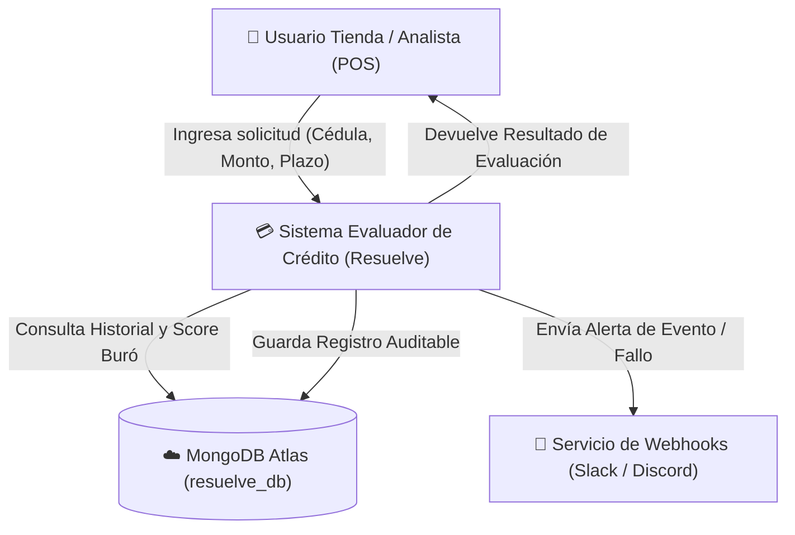
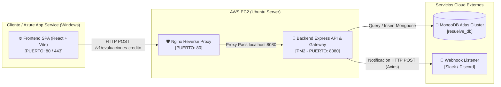
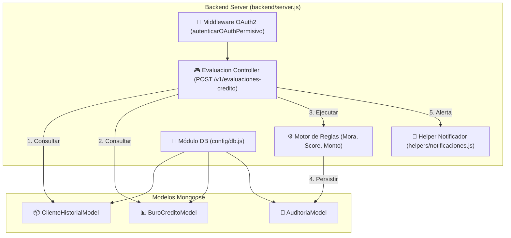

# 📑 Documentación Técnica Exhaustiva y Resumen Ejecutivo
**Proyecto Final**: Sistema Evaluador de Crédito en Tiempo Real  
**Arquitectura**: Frontend Desacoplado (Azure App Service) + API Gateway & Backend Node.js/Express (AWS EC2) + MongoDB Atlas + Notificaciones Webhook (Slack/Discord)

---

## 1. 🏛️ Resumen de la Arquitectura y Matriz de Cumplimiento

### 1.1 Descripción General de la Solución
El **Sistema Evaluador de Crédito** es una plataforma distribuida diseñada para automatizar la evaluación de solicitudes de crédito en puntos de venta (POS) y canales digitales. La solución combina:
- **Frontend SPA (Single Page Application)**: Desarrollado en React/Vite (desplegado en **Azure App Service - Windows**) con interfaz interactiva para captura de solicitudes y visualización de resultados.
- **Backend API RESTful & Gateway**: Desarrollado en Node.js/Express (desplegado en **AWS EC2 Ubuntu Server** mediante PM2), ofreciendo enrutamiento, autenticación OAuth2 (JWT), y procesamiento con motor de reglas.
- **Persistencia NoSQL (MongoDB Atlas)**: Base de datos distribuida en la nube (`resuelve_db`) que almacena la información de historial de clientes, score de buró y logs auditables.
- **Sistema de Alertas en Tiempo Real**: Notificaciones por HTTP Webhook hacia Slack/Discord ante cada evaluación procesada o fallo en la base de datos.

---

### 1.2 Matriz de Cumplimiento de Requerimientos Iniciales

| Requerimiento Técnico | Estado | Implementación y Evidencia |
| :--- | :---: | :--- |
| **Persistencia Real en MongoDB Atlas** | 🟢 **Cumplido** | Conexión Mongoose a `resuelve_db` con las colecciones `clientes_historial`, `buro_credito` y `auditorias`. Archivo: `backend/config/db.js`. |
| **Logs de Auditoría Persistentes** | 🟢 **Cumplido** | Inserción obligatoria mediante `AuditoriaModel.create()` tras cada evaluación (`APROBADO`, `RECHAZADO`, `REVISION_MANUAL`). Archivo: `backend/server.js`. |
| **Motor de Reglas Determinista** | 🟢 **Cumplido** | Evaluación secuencial basada en moras en sistema/buró, score Crediticio (< 700) y tope de monto (> $5,000). |
| **Seguridad OAuth2 / JWT** | 🟢 **Cumplido** | Emisión de tokens Bearer JWT vía `POST /oauth/token` (Client Credentials Flow) y middleware de autorización. |
| **Frontend Desacoplado & SPA Routing** | 🟢 **Cumplido** | Aplicación React/Vite empaquetada con `web.config` para reescritura de rutas en IIS/Windows Azure App Service. |
| **Alertas en Tiempo Real (Webhook)** | 🟢 **Cumplido** | Helper asíncrono con `axios` en `backend/helpers/notificaciones.js` a Slack/Discord. |

---

## 2. 🗺️ Mapa Completo de Rutas, Endpoints y Colecciones

### 2.1 Tabla de Endpoints HTTP (Contrato OpenAPI Spec 0 / Spec 1)

| Método | Ruta Endpoint (OpenAPI) | Entorno Local | Entorno Producción (AWS EC2) | Descripción / Función |
| :---: | :--- | :--- | :--- | :--- |
| **POST** | `/oauth/token` | `http://localhost:8080/oauth/token` | `http://44.197.171.122/oauth/token` | Genera Token JWT Bearer (Client Credentials). |
| **POST** | `/v1/evaluaciones-credito` | `http://localhost:8080/v1/evaluaciones-credito` | `http://44.197.171.122/v1/evaluaciones-credito` | Endpoint principal de evaluación de crédito. |
| **GET** | `/v1/evaluaciones-credito/:id` | `http://localhost:8080/v1/evaluaciones-credito/:id` | `http://44.197.171.122/v1/evaluaciones-credito/:id` | Consulta estado de evaluación por UUID. |
| **GET** | `/v1/clientes/:identificacion/historial` | `http://localhost:8080/v1/clientes/:id/historial` | `http://44.197.171.122/v1/clientes/:id/historial` | Consulta historial interno de cliente en Mongo. |
| **GET** | `/v1/score/:identificacion` | `http://localhost:8080/v1/score/:id` | `http://44.197.171.122/v1/score/:id` | Consulta score de Buró de crédito en Mongo. |
| **GET** | `/v1/auditoria/evaluaciones` | `http://localhost:8080/v1/auditoria/evaluaciones` | `http://44.197.171.122/v1/auditoria/evaluaciones` | Obtiene listado de auditorías registradas. |
| **GET** | `/health` | `http://localhost:8080/health` | `http://44.197.171.122/health` | Healthcheck de estado del backend y BD. |

---

### 2.2 Mapeo de Colecciones en MongoDB Atlas (`resuelve_db`)

1. **`clientes_historial`** (`backend/models/ClienteHistorial.js`):
   - `identificacion` (String, Único, Índice)
   - `tieneMoraVigente` (Boolean)
   - `creditosPrevios` (Number)
   - `ingresosDeclarados` (Number)
   - `antiguedadMeses` (Number)
2. **`buro_credito`** (`backend/models/BuroCredito.js`):
   - `identificacion` (String, Único, Índice)
   - `score` (Number: 300 - 850)
   - `tieneMoraBuro` / `reportadoEnMora` (Boolean)
   - `consultadoEn` (Date)
3. **`auditorias`** (`backend/models/Auditoria.js`):
   - `idEvaluacion` (String UUID, Único)
   - `identificacion` (String)
   - `decision` (`"APROBADO"`, `"RECHAZADO"`, `"REVISION_MANUAL"`)
   - `motivo` (String)
   - `scoreBuro` (Number)
   - `consultaBuroRealizada` (Boolean)
   - `tiendaId` (String)
   - `fecha` (Date)

---

## 3. 🧩 Diagramas de Arquitectura C4 (Mermaid)

### 3.1 Nivel 1: Diagrama de Contexto


---

### 3.2 Nivel 2: Diagrama de Contenedores


---

### 3.3 Nivel 3: Diagrama de Componentes (Backend Express)


---

## 4. 🧪 Batería de Pruebas Postman y Rendimiento (k6)

### 4.1 Flujo de Pruebas en Postman

1. **Paso 1: Autenticación OAuth2 Client Credentials**
   - **Request**: `POST http://44.197.171.122/oauth/token`
   - **Headers**: `Content-Type: application/json`
   - **Body (JSON)**:
     ```json
     {
       "grant_type": "client_credentials",
       "client_id": "frontend-tiendas",
       "client_secret": "secret-key-resuelve"
     }
     ```
   - **Response HTTP 200 OK**:
     ```json
     {
       "access_token": "eyJhbGciOiJIUzI1NiIsInR5cCI6IkpXVCJ9...",
       "token_type": "Bearer",
       "expires_in": 3600,
       "scope": "evaluaciones:escribir evaluaciones:leer auditoria:leer"
     }
     ```

2. **Paso 2: Evaluaciones de Crédito (Casos de Prueba)**

   - **Caso A: Solicitud APROBADA (Cédula `0503353138`)**
     - **Request**: `POST http://44.197.171.122/v1/evaluaciones-credito`
     - **Body (JSON)**:
       ```json
       {
         "identificacion": "0503353138",
         "montoSolicitado": 1200,
         "plazoMeses": 12,
         "tiendaId": "TIENDA-CENTRO-01"
       }
       ```
     - **Response HTTP 200 OK**:
       ```json
       {
         "idEvaluacion": "a1b2c3d4-e5f6-7890-abcd-1234567890ab",
         "decision": "APROBADO",
         "aprobado": true,
         "motivo": "Cumple reglas de score y capacidad de pago",
         "consultaBuroRealizada": true,
         "fecha": "2026-09-28T20:41:09.000Z"
       }
       ```

   - **Caso B: Solicitud RECHAZADA por Mora Vigente (Cédula `1710000001`)**
     - **Request**: `POST http://44.197.171.122/v1/evaluaciones-credito`
     - **Body (JSON)**:
       ```json
       {
         "identificacion": "1710000001",
         "montoSolicitado": 1500,
         "plazoMeses": 12,
         "tiendaId": "TIENDA-NORTE"
       }
       ```
     - **Response HTTP 200 OK**:
       ```json
       {
         "idEvaluacion": "b2c3d4e5-f6a7-8901-bcde-2345678901bc",
         "decision": "RECHAZADO",
         "aprobado": false,
         "motivo": "Mora vigente en historial interno o buró",
         "consultaBuroRealizada": true,
         "fecha": "2026-09-28T20:41:15.000Z"
       }
       ```

   - **Caso C: Solicitud en REVISIÓN MANUAL por Monto Elevado (> $5,000)**
     - **Request**: `POST http://44.197.171.122/v1/evaluaciones-credito`
     - **Body (JSON)**:
       ```json
       {
         "identificacion": "0503353138",
         "montoSolicitado": 8500,
         "plazoMeses": 24,
         "tiendaId": "TIENDA-SUR"
       }
       ```
     - **Response HTTP 200 OK**:
       ```json
       {
         "idEvaluacion": "c3d4e5f6-a7b8-9012-cdef-3456789012cd",
         "decision": "REVISION_MANUAL",
         "aprobado": false,
         "motivo": "Requiere aprobación por monto elevado",
         "consultaBuroRealizada": true,
         "fecha": "2026-09-28T20:41:20.000Z"
       }
       ```

3. **Paso 3: Consulta de Auditoría Almacenada**
   - **Request**: `GET http://44.197.171.122/v1/auditoria/evaluaciones`
   - **Response HTTP 200 OK**:
     ```json
     {
       "total": 3,
       "items": [
         {
           "idEvaluacion": "c3d4e5f6-a7b8-9012-cdef-3456789012cd",
           "identificacion": "0503353138",
           "decision": "REVISION_MANUAL",
           "motivo": "Requiere aprobación por monto elevado",
           "scoreBuro": 750,
           "fecha": "2026-09-28T20:41:20.000Z"
         }
       ]
     }
     ```

---

### 4.2 Resumen de Pruebas de Carga y Rendimiento con k6

1. **Prueba de Carga SOSTENIDA (`tests/k6/load-test.js`)**:
   - **Escenario**:
     - Ramp-up de 0 a 50 Virtual Users (VUs) en 30s.
     - Escalado a 150 VUs sostenidos durante 3 minutos.
     - Ramp-down a 0 VUs en 30s.
   - **Criterios de Aceptación (Thresholds)**:
     - `http_req_duration`: 95% de las peticiones atendidas por debajo de **2000 ms**.
     - `http_req_failed`: Tasa de falla inferior al **5%**.

2. **Prueba de PICO EXTREMO / STRESS (`tests/k6/spike-test.js`)**:
   - **Escenario**:
     - Carga base de 20 VUs (10s).
     - **Pico repentino a 500 VUs en 30 segundos**.
     - Mantenimiento del pico durante 1 minuto.
   - **Criterios de Aceptación (Thresholds)**:
     - `http_req_failed`: Tolerancia a errores < 15% durante la saturación de concurrencia.
